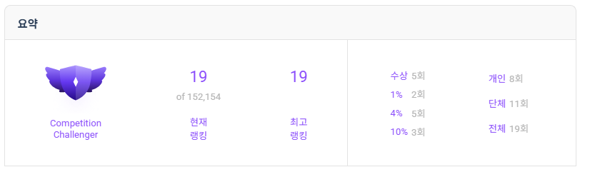

# Hi there! 👋 I'm Jinwook Kim

**서울과학기술대학교**
🔧 본전공: 기계공학과 | 🤖 복수전공: 인공지능응용학과

---

## 🏆 Dacon Ranking

---

## 📂 Competition & Projects

### 🥇 Award-Winning

| 🏅 | Competition | Rank | Link |
|:--:|:------------|:----:|:----:|
| 🥇 | **제1회 ART-AWS 리빙랩 글로컬 해커톤** | 🏆 **대상 (1위)** | [🔗](https://github.com/jinnwoook/The-1st-ART-AWS-Living-Lab-Glocal-Hackathon) |
| 🥇 | **제2회 ART-AWS 리빙랩 글로컬 해커톤** | 🏆 **대상 (1위)** | [🔗](https://github.com/jinnwoook/The-2nd-ART-AWS-Living-Lab-Glocal-Hackathon) |
| 🥈 | **Samsung AI Challenge 2025** - Document Understanding | **2nd / 77** | [🔗](https://github.com/jinnwoook/Visually-rich-Document-Understanding-2025-Samsung-AI-Challenge) |
| 🥈 | **교통사고 위험 예측 AI** - 행정안전부/NIA/KOTSA | **2nd / 437** | [🔗](https://github.com/jinnwoook/Traffic-Accident-Risk-Prediction-using-Cognitive-Characteristics-of-Commercial-Drivers) |
| 🏅 | **아모레퍼시픽 AI 챌린지 2026** - Agent04 | 🎖️ **특별상** | [🔗](https://github.com/jinnwoook/AmorePacific_Agent-2026-_AmoreClue) |
| 🏅 | **LG Aimers 3기** - 온라인 판매량 예측 | 예선 39/747 → **본선 4th / 43** | [🔗](https://github.com/jinnwoook/LGaimers_3th) |
| 🏅 | **LG Aimers 5기** - 디지털 트윈 품질 개선 | **본선 6th** | [🔗](https://github.com/jinnwoook/LGaimers_5th) |
| 🏅 | **K리그-서울시립대 공개 AI 경진대회** | 🎖️ **장려상 (6th / 937)** | - |
| 🏅 | **스마트 제조 AI Agent 해커톤** | **본선 6th / 16** | - |

### 📊 Competition History

| Competition | Rank | Link |
|:------------|:----:|:----:|
| **제2회 Medi AI(MAI) 경진대회** | **7th / 477** | - |
| **KSPHM-KIMM 베어링 잔여수명 예측** | **7th** | [🔗](https://github.com/jinnwoook/RUL-Prediction-using-Bearing-Degradation-Data) |
| **LG Aimers 4기** - B2B 영업 기회 예측 | **본선 14th** | [🔗](https://github.com/jinnwoook/LGaimers_4th) |
| **LG Aimers 6기** - 난임 환자 임신 성공률 예측 | 예선 15/794 → 본선 21/27 | [🔗](https://github.com/jinnwoook/LGaimers_6th) |
| **토스 NEXT ML CHALLENGE** - CTR 예측 | **16th / 709** | - |
| **제3회 국민대학교 AI 빅데이터 분석 경진대회** | **25th / 960** | - |
| **2025 전력사용량 예측 AI 경진대회** | 48th / 934 | - |
| **HAI 헥토 AI Challenge** - Deepfake Detection | **23rd** | [🔗](https://github.com/jinnwoook/Deepfake-Detection-AI-Development) |

---

## 🛠️ Tech Stack

---

*"Data-driven solutions with Engineering mindset"*

