

# 🔬 Bonding Insight

### 스마트 제조 AI Agent 해커톤 2025 — **본선 6위 / 16팀**

**초음파(SAT)·단면(SEM) 영상 기반 보이드 검출 및 하이브리드 본딩 공정 이상 원인 예측 자동화 에이전트 구축**

> 주최: 차세대융합기술연구원 × DACON | 팀명: Bonding Insight | 팀원: 김진욱

---

## 📑 발표 자료

---

### Slide 1 — 타이틀

  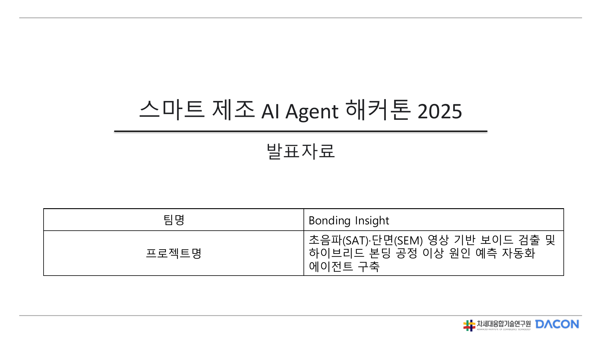

> **팀명: Bonding Insight** | 반도체 하이브리드 본딩 공정에서 발생하는 보이드(Void) 결함을 SAT·SEM 영상으로 자동 검출하고, Multi-Agent System으로 이상 원인을 분석·예측하는 자동화 에이전트를 구축합니다.

---

### Slide 2 — 프로젝트 요약 (Summary)

  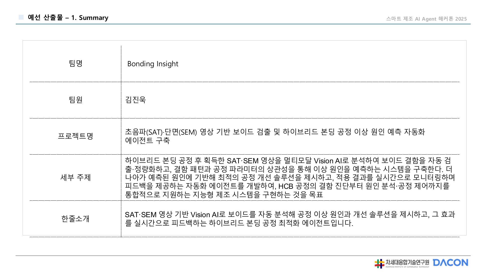

> 하이브리드 본딩 공정 후 획득한 SAT·SEM 영상을 Vision AI로 분석하여 보이드 결함을 자동 검출하고, 공정 파라미터의 상관성 분석을 통해 이상 원인을 예측하는 시스템을 구축합니다. 더 나아가 최적화된 공정을 제안하는 에이전트 파이프라인을 개발하며, HCB 공정의 결함 진단부터 원인 분석·공정 제어까지 통합적으로 지원하는 자동화 시스템을 구현합니다.

---

### Slide 3 — 문제 정의 (Problem Definition)

  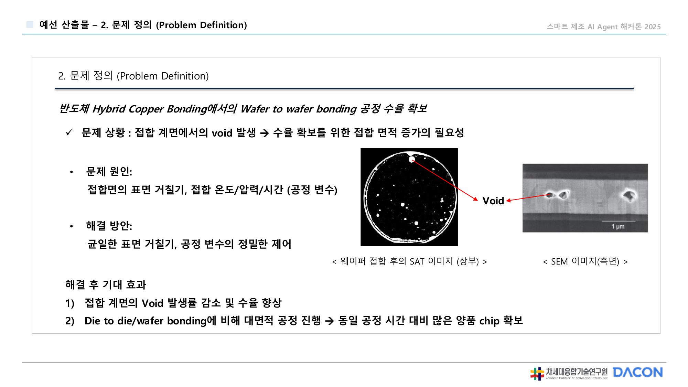

> **반도체 Hybrid Copper Bonding의 Wafer to wafer bonding 공정 수율 문제**
>
> - **문제 상황**: 접합 계면에서의 Void 발생 → 수율 확보를 위한 접합 면적 증가의 필요성
> - **문제 원인**: 접합면의 표면 거칠기, 접합 온도/압력/시간 등 공정 변수
> - **해결 방안**: 균일한 표면 거칠기, 공정 변수의 정밀한 제어
> - **해결 후 기대 효과**: 접합 계면의 Void 발생 감소 및 수율 향상, Die to die/wafer bonding에 비해 대면적 공정 진행 → 동일 공정 시간 대비 많은 양의 chip 확보

---

### Slide 4 — 솔루션 개요 (Solution Overview)

  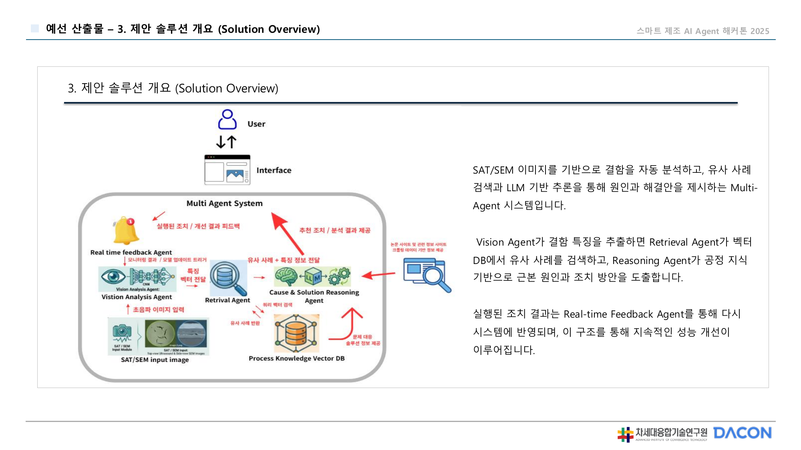

> **Multi-Agent System 구성** — SAT/SEM 이미지를 기반으로 결함을 자동 분석하는 4단계 에이전트 파이프라인입니다.
>
> 1. **Vision Analysis Agent** → 결함 특징 추출 및 Feature Vector 생성
> 2. **Retrieval Agent** → Vector DB에서 유사 사례 검색, LLM 주문을 통해 원인과 해결책 제시
> 3. **Cause & Solution Reasoning Agent** → 공정 지식 기반으로 근본 원인 추론 및 해결 방안 도출
> 4. **Real-time Feedback Agent** → 실험 조치 반영, 시스템에 재피드백하여 지속적 성능 개선

---

### Slide 5 — 주요 기능 정의 (Key Features)

  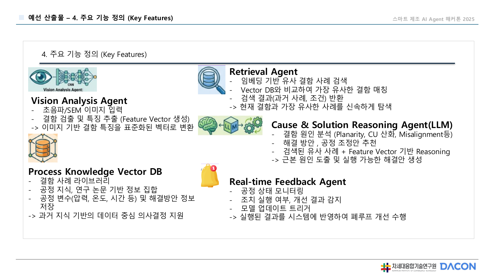

> | 에이전트 | 역할 |
> |:---|:---|
> | **Vision Analysis Agent** | 초음파/SEM 이미지 분석, 결함 검출, Feature Vector 생성 및 표준화 |
> | **Retrieval Agent** | 임베딩 기반 유사 결함 사례 검색, Vector DB 비교·매칭 |
> | **Cause & Solution Reasoning Agent (LLM)** | 결함 원인 분석(Planarity·Cu 산화·Misalignment 등), Feature Vector 기반 Reasoning으로 해결 방안 추천 |
> | **Process Knowledge Vector DB** | 공정 사례 라이브러리, 공정 변수(온도·압력·시간) 및 해결 방안 정보 저장 |
> | **Real-time Feedback Agent** | 공정 상태 모니터링, 조치 실행·검증, 모델 업데이트 및 결과를 시스템에 반영 |

---

### Slide 6 — 활용 데이터

  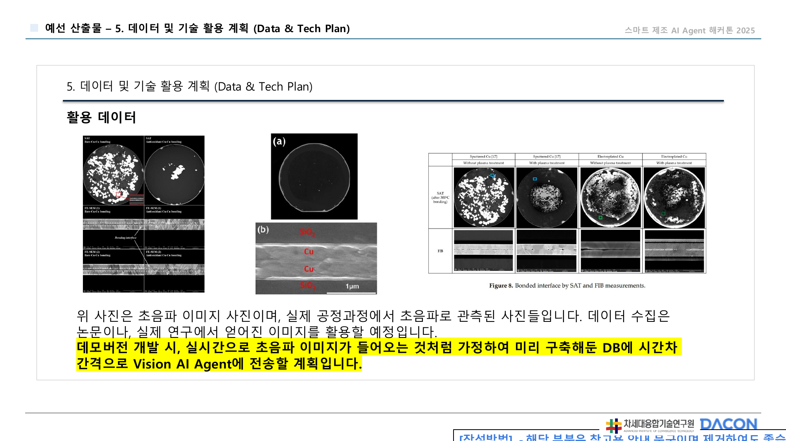

> 실제 공정 과정에서 촬영한 **초음파(SAT) 이미지**를 핵심 데이터로 활용합니다. 데이터 수집은 실제 연구에서 얻은 논문을 참고하며, 데모버전 개발 시 실시간으로 초음파 이미지가 들어오는 것처럼 가정하여 미리 DB를 구축하고 이를 Vision AI Agent에 전달하는 방식으로 구현합니다.

---

### Slide 7 — 데이터 처리 방식

  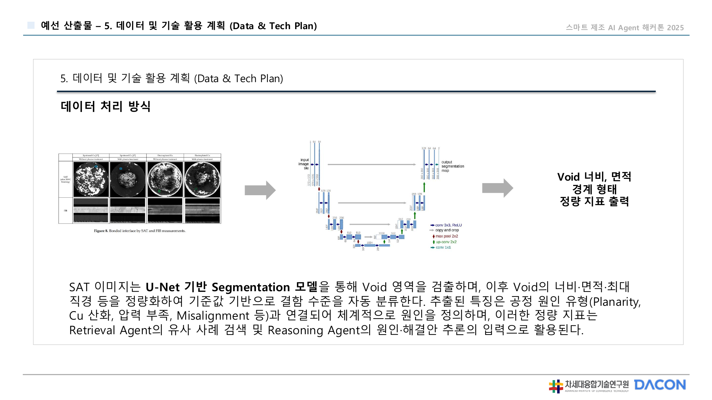

> **U-Net 기반 Segmentation 파이프라인** — SAT 이미지를 U-Net 기반 Segmentation 모델로 처리하여 Void 영역을 검출합니다.
>
> - Void의 너비·면적·최대 직경을 기준값 기반으로 자동 분류
> - 추출된 특징을 공정 원인(Planarity·Cu 산화·압력 부족·Misalignment 등)과 연결하여 체계적으로 정의
> - 결과물은 **Retrieval Agent의 유사 사례 검색** 및 **Reasoning Agent의 원인·해결안 추론**의 입력으로 활용

---

### Slide 8 — 데모: 모니터링 챗봇 화면

  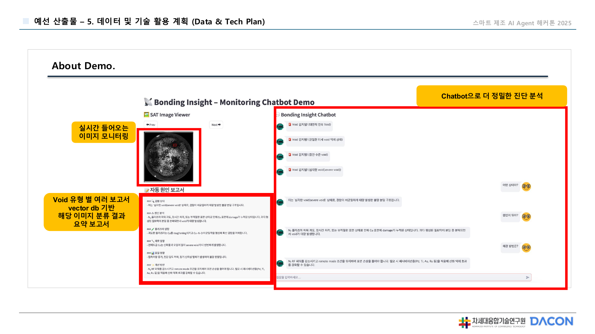

> **Bonding Insight Monitoring Chatbot Demo** — 실시간으로 들어오는 SAT 이미지를 모니터링하고, Void 유형 별 분류 보고서와 해당 이미지 분류 결과를 요약 보고서 형태로 챗봇이 제공합니다. Chatbot으로 더 정밀한 진단 분석도 가능합니다.

---

### Slide 9 — 데모: 시스템 아키텍처

  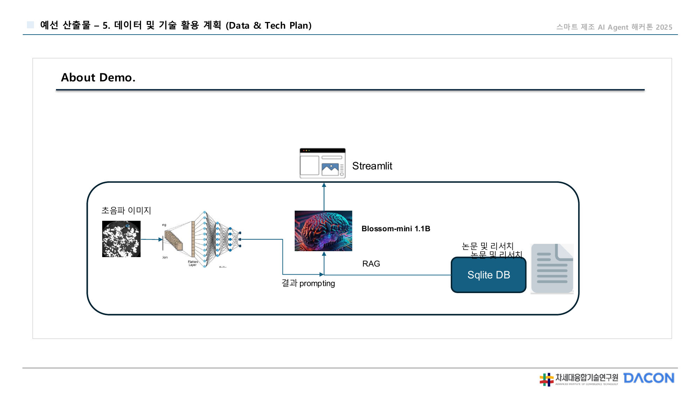

> **데모 기술 스택** — 초음파 이미지 → **U-Net Segmentation** → 결과 prompting → **Blossom-mini 1.1B** (경량 LLM) + **RAG** (Sqlite DB 기반 논문·리서치 검색) → **Streamlit** 대시보드로 시각화합니다.

---

### Slide 10 — 데모: 실제 분석 결과

  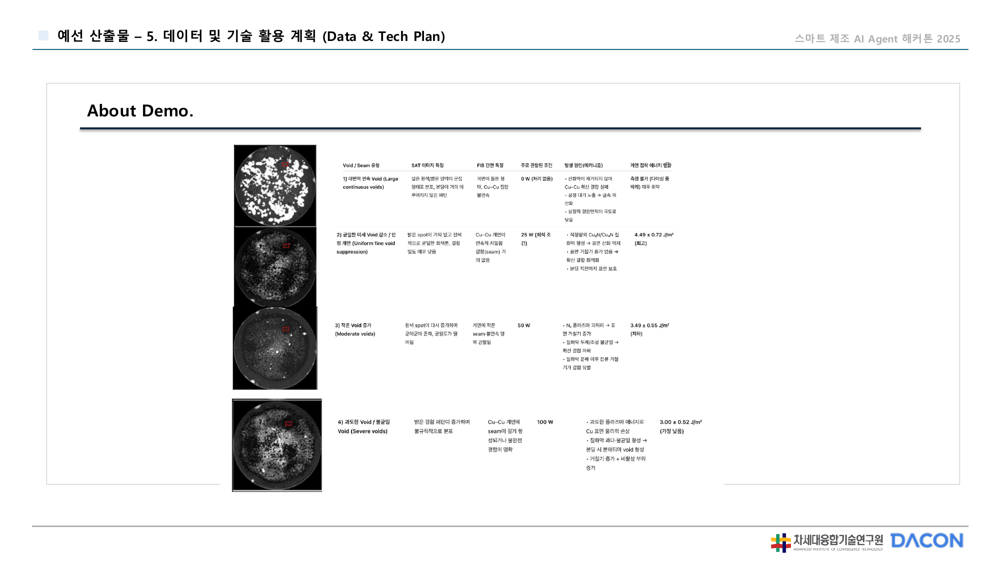

> 실제 SAT 이미지 3가지 케이스(정상·경미 결함·심각 결함)에 대해 Segmentation 결과와 Void 수치(너비·면적), 결함 원인 분석 및 권장 조치를 자동으로 생성한 결과 테이블입니다.

---

### Slide 11 — 사용자 시나리오: 페르소나

  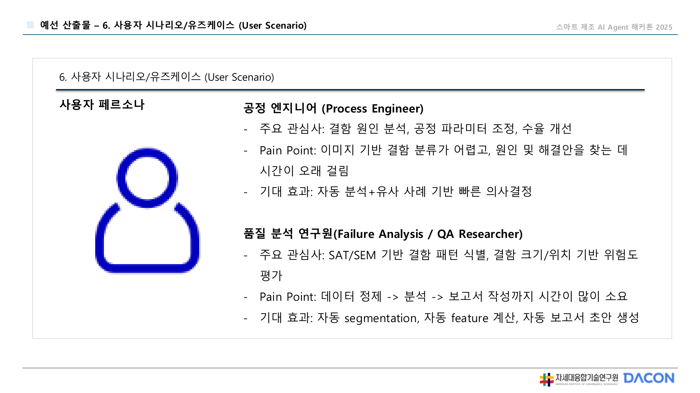

> **공정 엔지니어 (Process Engineer)**
> - Pain Point: 이미지 기반 결함 분류가 어렵고, 원인 및 해결안을 찾는 데 시간이 오래 걸림
> - 기대 효과: 자동 분석 + 유사 사례 기반 빠른 의사결정
>
> **품질 분석 연구원 (Failure Analysis / QA Researcher)**
> - Pain Point: 데이터 정제 → 분석 → 보고서 작성까지 시간이 많이 소요
> - 기대 효과: 자동 segmentation, feature 계산, 자동 보고서 조언 생성

---

### Slide 12 — 사용자 사용 흐름

  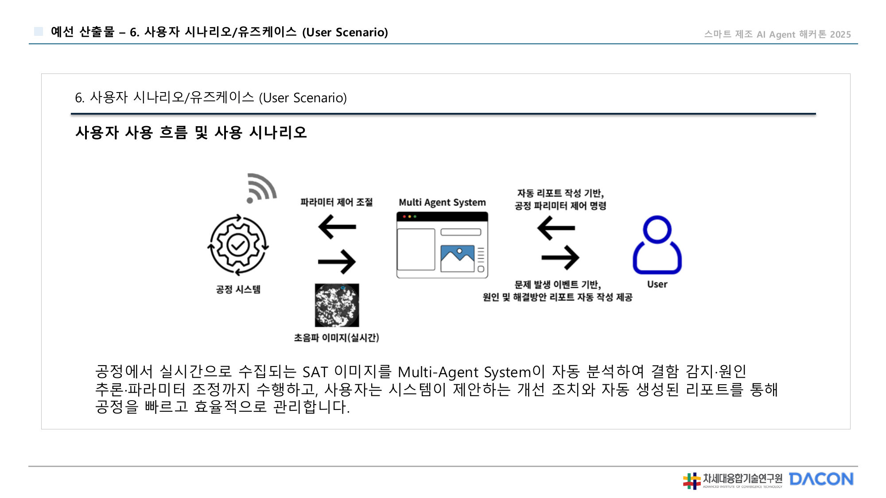

> 공정에서 실시간으로 수집되는 SAT 이미지를 **Multi-Agent System**이 자동 분석하여 결함 원인·해결 방안을 도출합니다. 사용자는 시스템이 제안하는 개선 조치와 자동 생성된 리포트를 통해 공정 파라미터 제어 명령을 내리고, 공정을 빠르고 효율적으로 관리합니다.

---

### Slide 13 — 기대 효과 및 향후 확장성

  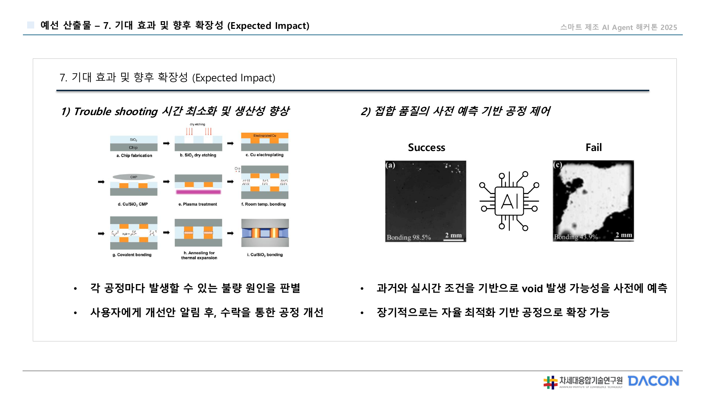

> **1) Trouble Shooting 시간 최소화 및 생산성 향상**
> - 각 공정마다 발생할 수 있는 불량 원인을 자동 판별
> - 사용자에게 개선안 알림 후, 수락을 통한 공정 자동 개선
>
> **2) 접합 품질의 사전 예측 기반 공정 제어**
> - 과거와 실시간 조건을 기반으로 Void 발생 가능성을 사전 예측
> - 장기적으로는 자율 최적화 기반 공정으로 확장 가능

---

## 🧰 Tech Stack

| 분류 | 기술 |
|:---|:---|
| **Vision AI** | U-Net (SAT 이미지 Segmentation) |
| **LLM** | Blossom-mini 1.1B |
| **RAG** | LangChain + SQLite DB |
| **Frontend** | Streamlit |
| **Agent Framework** | Multi-Agent System (Vision / Retrieval / Reasoning / Feedback) |
| **Language** | Python |

---

  <b>🏅 스마트 제조 AI Agent 해커톤 2025 — 본선 6위 / 16팀</b> 
  <i>차세대융합기술연구원 × DACON | Team Bonding Insight | 김진욱</i>

